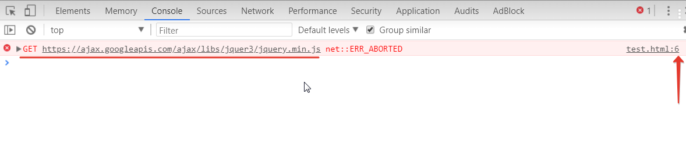
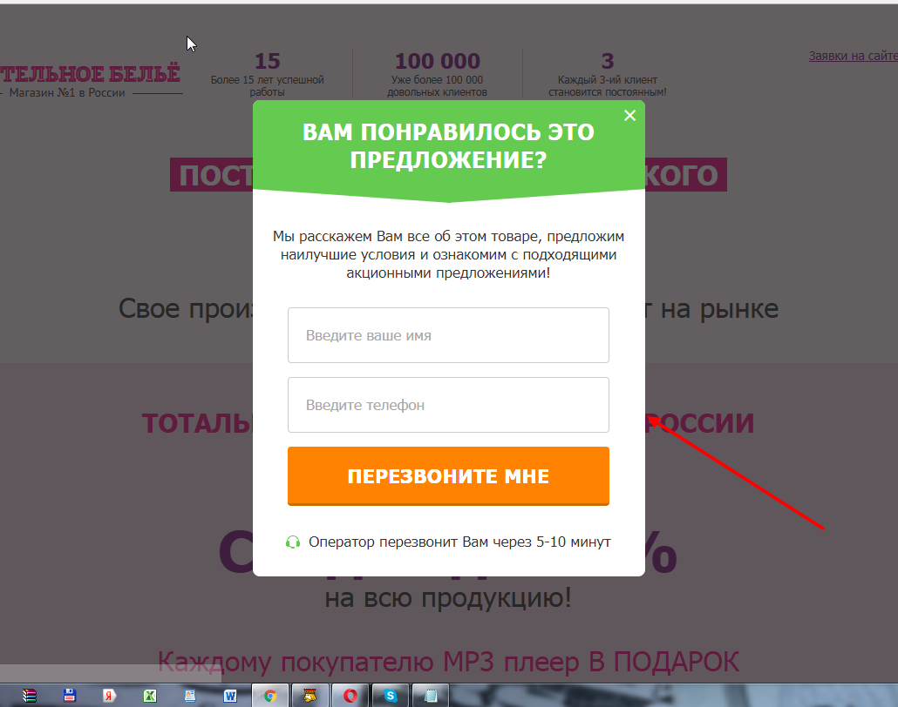
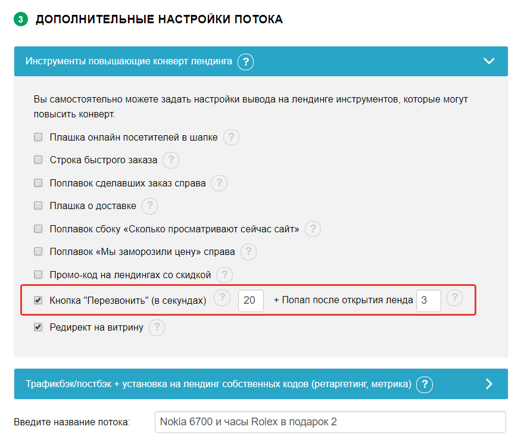
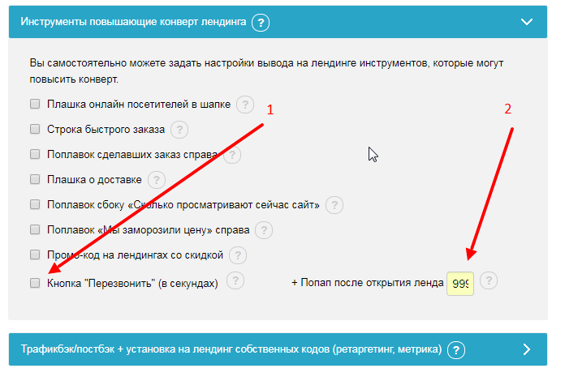
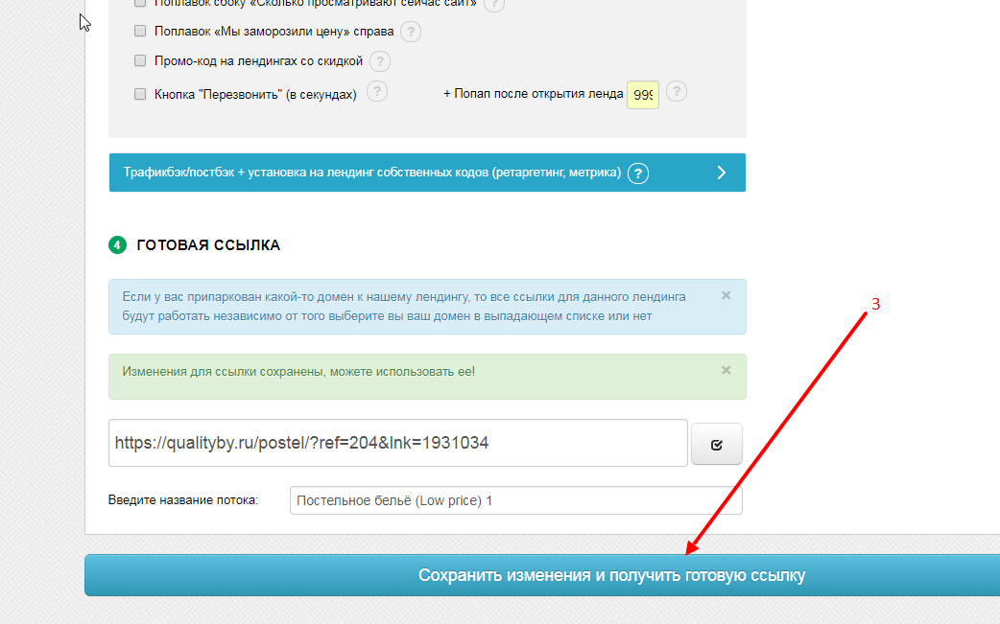
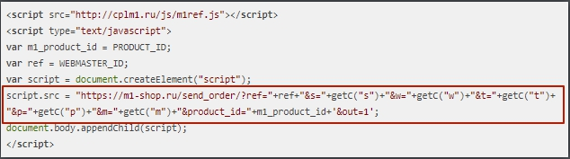

1. Документация по API.
1.1. Передача заказов и статистики по API.
Самый популярный и простой способ передачи заказов и статистики это настройка API через javascript. Можно разделить весь код API на две части, первая часть служит для сбора статистики, при каждом посещении сайта (лендинга) он отправляет информацию к нам на сервер и считает посетителей и визиты:

```
<script src="/m1ref.js"></script>

<script type="text/javascript">

var m1_product_id = PRODUCT_ID;

var ref = WEBMASTER_ID;

var script = document.createElement("script");

script.src = "https://m1.top/send_order/?ref="+ref+"&s="+getC("s")+"&w="+ getC("w")+"&t="+ getC("t")+"&p="+ getC("p")+"&m="+ getC("m")+"&product_id="+ m1_product_id+'&out=1';

document.body.appendChild(script);

</script>
```

Вам необходимо скачать файл https://m1.top/js/m1ref.js и подключить его локально, загрузив в директорию лендинга, подключение локально происходит с помощью кода выше. 


Этот код необходимо вставить между тегами <body> ... </body> и поменять переменные на свои.
WEBMASTER_ID - это ваш ID в нашей системе. 
PRODUCT_ID - это ID продукта у нас в системе.
LANG_CODE - это буквенное представление ГЕО (товара, на который вам нужно отправлять заказы). Его можно найти в карточке оффера в 1 пункте "ВЫБЕРИТЕ ГЕО" в селекторе ГЕО.
На этом настройка передачи статистики закончена, приступаем к передаче заказов. Для этого нужно в коде лендинга изменить все формы. Добавив два служебных поля:
<input type="hidden" name="product_id" value="PRODUCT_ID"/>
<input type="hidden" name="ref" value="WEBMASTER_ID"/>
<input type="hidden" name="langCode" value="LANG_CODE"/>

Между полями <form>...</form>

Полезный совет: Для того чтобы быстро найти все формы в коде страницы, нажмите ctrl+F и введите <form , так вы не пропустите не одной формы.

Поле action="" нужно оставить пустым и добавить обработчик формы:

onsubmit="urlGen(this);" или так (с проверкой введенных данных):

onsubmit="if(this.name.value==''){alert('Введите Ваше имя!');return false}if(this.phone.value==''){alert('Введите Ваш номер телефона!');return false}urlGen(this);return true;"

Итак, должен получиться примерно такой код формы (упрощенный вариант, у вас могут быть свои стили или какие-то дополнительные поля):

<form action="" method="post" onsubmit="if(this.name.value==''){alert('Введите Ваше имя!');return 
false}if(this.phone.value==''){alert('Введите Ваш номер телефона!');return false}urlGen(this);return true;"> 
<input type="hidden" name="product_id" value="PRODUCT_ID"/> 
<input type="hidden" name="ref" value="WEBMASTER_ID"/> 
<input placeholder="ФИО" maxlength="25" name="name" type="text"> 
<input placeholder="Телефон" maxlength="25" name="phone" type="text"> 
<button type="submit">Заказать!</button> 
</form>
После отправки формы, если все данные переданы верно будет выводится сообщение "Спасибо за заказ", также это сообщение будет выводиться при повторном (дубликате) заказе, но сам заказ в таком случае добавлен не будет.

Если при настройке формы есть ошибки, будет выводиться сообщение "Ошибка в настройке формы, в форме указаны не все параметры"

Если в форме покупатель не указал ФИО или Телефон, будут выводиться соответствующие сообщения.

1.2. Передача заказов по Апи со своей страницей "Спасибо".

Если вы хотите, чтобы после заказа клиент попадал на вашу страницу “Спасибо”, вам нужно добавить код между тегами <head> ... </head> на главную страницу лендинга:

<script src="//ajax.googleapis.com/ajax/libs/jquery/2.1.3/jquery.min.js"></script> 

Также нужно добавить еще один код, который распологается ниже, между тегами <body> ... </body> главной страницы вашего сайта и поменять переменные на свои.

```
<script type="text/javascript">

var QueryString = function () {
    var query_string = {};
    var query = window.location.search.substring(1);
    var vars = query.split("&");
    for (var i=0;i<vars.length;i++) {
        var pair = vars[i].split("=");
        if (typeof query_string[pair[0]] === "undefined") {
            query_string[pair[0]] = decodeURIComponent(pair[1]);
        } else if (typeof query_string[pair[0]] === "string") {
            var arr = [ query_string[pair[0]],decodeURIComponent(pair[1]) ];
            query_string[pair[0]] = arr;
        } else {
            query_string[pair[0]].push(decodeURIComponent(pair[1]));
        }
    }
    return query_string;
}();

/* user parameters */
var webmaster_id = WEBMASTER_ID;
var webmaster_api = 'WEBMASTER_API';
var product_id = PRODUCT_ID;

/* 
Язык лендинга (для бурж лендингов)

Указывается для того, чтобы все заказы, независимо от IP юзера приходили на ГЕО,
связанное с лендом.

Пример: let langCode = 'es';

Таким образом, даже если пользователь зайдет на лендинг с российского IP,
и у оффера есть при этом RU ГЕО, то заказ все равно уйдет на Испанию (ES)
*/
let langCode = '';

/* not change */
var client_ip = '127.0.0.1';
var client_s = '';
var client_w = '';
var client_t = '';
var client_p = '';
var client_m = '';

function sendData(client_name, client_phone) {
    $.ajax({
        type: 'POST',
        data: {
            ref: webmaster_id,
            api_key: webmaster_api,
            product_id: product_id,
            phone: client_phone,
            name: client_name,
            ip: client_ip,
            s: client_s,
            w: client_w,
            t: client_t,
            p: client_p,
            m: client_m,
            referer: document.referrer,
            langCode: langCode
            },
        url: 'https://m1.top/send_order/',
        success: function(data) {
            //console.log(data);
            data = JSON.parse(data);
            if (data.result == "ok") {
                //alert('Заказ создан, ID:' + data.id);
                window.location.replace("call.html?order_id=" + data.id + "&s=" + client_s + "&w=" + client_w + "&t=" + client_t + "&p=" + client_p + "&m=" + client_m);
            }
            else {
                //alert('Заказ НЕ создан, ответ: ' + data);
                window.location.replace("error.html?s=" + client_s + "&w=" + client_w + "&t=" + client_t + "&p=" + client_p + "&m=" + client_m);
            }
        },
        error: function(xhr, status, error) { // if error occured
            console.log(xhr.statusText, xhr.responseText, status, error);

            respjs = JSON.parse(xhr.responseText);
            //alert('Заказ НЕ создан, ответ: ' + respjs.message);
            window.location.replace("error.html?s=" + client_s + "&w=" + client_w + "&t=" + client_t + "&p=" + client_p + "&m=" + client_m);            //$(placeholder).append(xhr.statusText + xhr.responseText);
            //$(placeholder).removeClass('loading');
        }
    });
    return false;
};


$(document).ready(function() {

    client_s = QueryString.s;
    client_w = QueryString.w;
    client_t = QueryString.t;
    client_p = QueryString.p;
    client_m = QueryString.m;

    $.getJSON('https://ipapi.co/json/', function(data) {
        //console.log(JSON.stringify(data, null, 2));
        json_data = data;
        client_ip = json_data.ip;
        //console.log(client_ip);
    });

    $('form').submit(function() {
	    var elem = $(this),
	    	button = $("[type=submit], button",elem);
	    	
        $('input[name=name]', this).val($.trim($('input[name=name]', this).val()));
        if (!$('input[name=name]', this).val()) {
            alert('Укажите корректные ФИО!');
            return false;
        }

        if (!$('input[name=phone]', this).val() || $('input[name=phone]', this).val().length < 7) {
            alert('Укажите корректный телефон!');
            return false;
        }
        
        button.prop("disabled",true);
        sendData($('input[name=name]', this).val(), $('input[name=phone]', this).val());
        return false;
    });
});
</script>
```

call.html - это ваша страница Спасибо, она должна находиться в той же директории что и основной скрипт: (например: http://ваш-сайт/call.html)

Но можете указать другую или вообще указать страницу на другом сайте (напр.: http://ваш-сайт/spasibo.html) Если вы измените на spasibo.html, то в коде который расположен выше, вам нужно будет также изменить ее, вместо call.html прописать spasibo.html

После отправки формы, если все данные переданы верно будет редирект на вашу страницу “Спасибо”.

Если после отправки формы, система M1-shop вернет ошибку или сообщение о дубликате заказа, то произойдет редирект на страницу error.html (внешне это полный аналог страницы "Спасибо", за исключением того, что на ней отключены Яндекс, Google и прочие метрики)

1.3. Часто задаваемые вопросы

А) Заказы не отпраляются

Если при нажатии на кнопку "Заказать" ничего не происходит или страница перезагружается, но заказа нет в системе m1-shop. Скорее всего это связано с ошибками JavaScript. Для их устранения откройте в браузере панель отладки, нажатием F12 и перейдите в консоль (подчеркнута синим).


Как правило по тексту ошибки можно понять в чем проблема и попытаться устранить ее собственными силами. К примеру в этом случае видно, что возникают ошибки в 6 строке при попытке загрузки Jquery.

Б) Не приходят заказы с формы "Перезвоните мне"
Вебмастера часто копируют лендиги с обратной формой заказа:


С этой формой очень часто возникают вопросы, почему заказы не приходят в систему, когда клиент оставляет заказ по ней.

Решение:

Для того чтобы переделать эту системную форму под передачу заказов по API нужно обладать продвинутыми навыками JavaScript, поэтому проще всего будет ее просто отключить. Это можно сделать двумя способами:

1. Удалить код вызова из самого лендинга.
(Поиск в коде лендинга: ctrl+f) - и просто удаляете код который написан ниже.

```<script type="text/javascript">
$(function(){
            M1.initComebacker(3000);
            var M1Text = {
                        'validation_name': 'Укажите корректные ФИО.',
                        'validation_phone1': 'Номер телефона может содержать только цифры, символы "+", "-", "(", ")" и пробелы.',
                        'validation_phone2': 'В вашем телефоне слишком мало цифр.',
                        'comebacker_text': 'ВНИМАНИЕ'
            };
            M1.validateAndSendForm(false, M1Text);
});
</script>```

2. Убрать галочку при генерации ссылки на лендинг и скопировать его снова.
Так показывается при стандартных настройках.



Вы ставите вот так:

Убираете галочку
Ставите число 99999 в данное поле
Нажимаете “Сгенерировать ссылку”





После этого, форма “Перезвоните мне” показываться на лендингах не будет.

B) Не меняется цена и валюта для клиентов из других стран
Определение ГЕО клиента на наших лендингах происходит на стороне сервера, поэтому нет возможности сделать динамическое подставление цены и валюты через javascript API.

Г) Несовместимость http и https протокола
Иногда возникают ситуации когда ваш сайт работает по защищенному протоколу https и отказывается загружать файлы по незащищенному соединению. К примеру файл с функциями API http://m1.top/js/m1ref.js В таком случае сохраните этот файл у себя на хостинге и подключите его локально. К примеру так:

<script src="/js/m1ref.js"></script>
Т.е. у вас в коде после скачивание лендинга будет прописано вот так:

<script src="http://m1.top/js/m1ref.js"></script>

А вы делаете так:

Скачиваете файл: http://m1.top/js/m1ref.js
Размещаете его в директории лендинга, у себя на хостинге
И заменяете в корневом файле index.php или index.html строчку:

<script src="http://m1.top/js/m1ref.js"></script> на <script src="/js/m1ref.js"></script>​
Готово)

Д) Как передавать метки через API
После того как мы настроили передачу заказов по инструкции выше, ничего дополнительного в коде прописывать не надо, т.к. за нас уже скрипт для передачи меток прописан.


Все что нам остается это передать прописать метки в самой ссылке:

Пример: www.домен.ru/?s=”значение”&w=”значение”&t=”значение”&p=”значение”&m=”значение”

После этого метки будут передаваться в ПП.

1.4. Другие способы отправки заказов и получения статусов.

Если вам необходимо отправлять информацию со своего сервера, ниже пример реализации отправки заказов посредством языка PHP, но логику можно применить на любом.


Простой пример передачи заказов средствами PHP:

```<?php

$url = 'http://m1.top/send_order/';
$data = [
'ref' => 1234,
'api_key' => 'ddd5e8a4750a34370c83e40315d985e8',
'product_id' => 2805,
'phone' => $_REQUEST['phone'],
'name' => $_REQUEST['name'],
'ip' => $_SERVER['REMOTE_ADDR'],
's' => 'test_s',
'w' => 'test_w',
't' => 'test_t',
'p' => 'test_p',
'm' => 'test_m'
];

/** 
 * Язык лендинга (для бурж лендингов)
 * 
 * Указывается для того, чтобы все заказы, независимо от IP юзера приходили на ГЕО,
 * связанное с лендом.
 * 
 * Пример: $data['langCode'] = 'es';
 * 
 * Таким образом, даже если пользователь зайдет на лендинг с российского IP,
 * и у оффера есть при этом RU ГЕО, то заказ все равно уйдет на Испанию (ES)
 */
$data['langCode'] = '';

$process = curl_init();
curl_setopt($process, CURLOPT_HEADER, 0);
curl_setopt($process, CURLOPT_USERAGENT, "Mozilla/4.0 (compatible; MSIE 7.0; Windows NT 5.1; .NET CLR 1.0.3705; .NET CLR 1.1.4322; Media Center PC 4.0)");
curl_setopt($process, CURLOPT_RETURNTRANSFER, 1);
curl_setopt($process, CURLOPT_FOLLOWLOCATION, 0);
curl_setopt($process, CURLOPT_TIMEOUT, 20);
curl_setopt($process, CURLOPT_SSL_VERIFYPEER, false);
curl_setopt($process, CURLOPT_POST, true);
curl_setopt($process, CURLOPT_POSTFIELDS, $data);
curl_setopt($process, CURLOPT_URL, $url);

echo $return = curl_exec($process);

curl_close($process);

?>
```

Ответ будет в формате JSON, примеры ответов:

{"result":"visit_ok","id":0} - Переданы не все параметры, заказ не добавлен, записано посещение.
{"result":"ok","id":237629} - заказ успешно добавлен, ID заказа в системе M1-shop 237629

Если не будут переданы обязательные параметры ФИО и Телефон, то система будет считать, что это переход, а не заказ. В таком случает ответ будет следующим:
{"result":"visit_ok","id":0} - Переданы не все параметры, заказ не добавлен, записано посещение.

1.5. Получение офферов.
Для получения списка всех активных офферов, необходимо выполнить GET-запрос:

http://m1.top/offers_export_api/?webmaster_id=WEBMASTER_ID&api_key=WEBMASTER_API

WEBMASTER_API - он находится вот по этой ссылке: http://m1.top/cabinet
WEBMASTER_ID - это ваш ID в нашей системе, его можно скопировать по этой ссылке: http://m1.top/cabinet.

Так же к запросу можно добавить параметр product_id, для получения информации о конкретном оффере.

http://m1.top/offers_export_api/?webmaster_id=WEBMASTER_ID&api_key=WEBMASTER_API&product_id=PRODUCT_ID

PRODUCT_ID - это ID продукта у нас в системе, найти можно в карточке оффера.

Ответ будет в формате JSON.

Описание полей:


id - ID оффера в системе
name - Название оффера в системе
product_id - ID основного продукта, используется для передачи по API
info - краткое описание оффера
top - Флаг топовый оффер или нет (1/0)
target - массив с целями по ГЕО
code - код страны
currency - код валюты
price - цена со скидкой
price_high - цена без скидки
pay - вознаграждение вебмастеру
geo_name - название страны
callm1 - Наш КЦ или рекламодателя (1/0)
tracking_link - массив с Вашими сгенерированными ссылками
landing - массив с лендингами оффера
id - ID лендинга в системе
url - URL лендинга
type - тип m - мобильный, d - десктопный
transit_page - массив с транзитными страницами
id - ID прокладки в системе
url - URL прокладки
img - Изображение оффера 
cr - CR оффера
user_access - уровень доступа
epc - EPC оффера